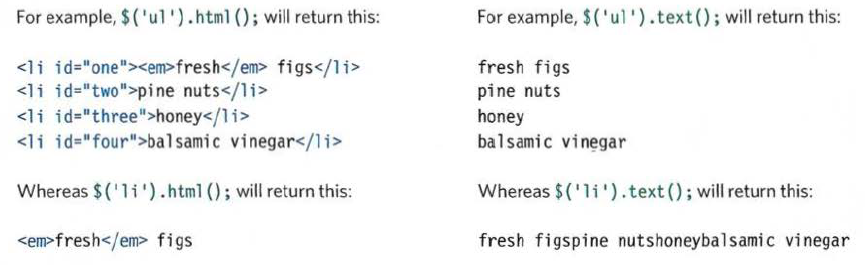
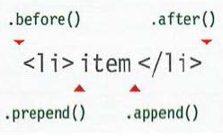
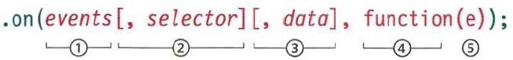

## jQuery, Events, and The DOM

### JavaScript and jQuery book by Jon Duckett pages 293-301, 306-331 and 354-357

**jQuery** is a JavaScript library which allows you to manipulate HTML elements in a much simpler way using CSS selectors.

* To access **jQuery** use `$('css-selector')`.

* To get an HTML element content use either `.html()` which returns the whole content including the html elements, or use `text()`
that returns the text only.

You can also use them to change the content.

* To add new content use: `.prepend()` which adds new content before the content of the selected element, `.append()` which adds new content after the content of the selected element, `.before()`
which adds new content before the  selected element, and `.after()` which adds new content after the  selected element.

* You can also add class and attributes using `.addClass()`, `.attr()`, and remove them using `.removeClass()`, `.removeAttr()`.

* To add an event listener use `.on()` as the following:\

### 6 Reasons for Pair Programming

Pair programming allows you to experience the work environment in almost every aspect, such as learning from the others, having two minds to write a code is more efficient, improving the social skills, and explaining your code to other people makes you understand your code even more.