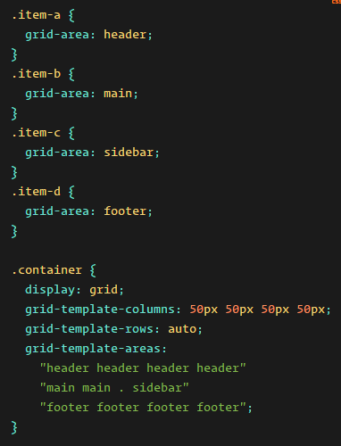
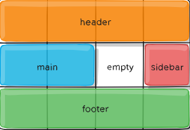

##  Responsive Web Design and Regular Expressions

### Grid

* **Container rules**

* `display: "grid or inline-gird;"` defines the container as a grid, **gird** for block level grid and **inline-grid** is for inline level grid.

* `grid-template-columns` and `grid-template-rows` to specify the size of each column and row, when specifying a value you implicitly adding a new section.

* `grid-area-name` specifying the name of each partition, and by using `grid-area` as a property added to the items you can assign multiple partitions to an item, as the following figure:

* `column-gap`, `row-gap`, `grid-column-gap`, `grid-row-gap` to add gaps between the cells, `gap` is a shorthand version.

* **Items rules**

* `grid-column-start`, `grid-column-end`,`grid-row-start`, `grid-row-end` to specify where an item start from and ends at.

* `grid-column`, `grid-row` this is a shorthand version of the rule above.

* `justify-self` to algin an item horizontally.

* `align-self` to algin an item vertically.

***

### REGEX (Regular Expressions)

**REGEX** are expressions that can be used to extract information from a certain text by specifying a certain word or expression that you are looking for in addition to some symbols that make your search even more specific. 

This tool can be used for almost all programming languages even in the terminal when searching for a certain text inside of a file.
